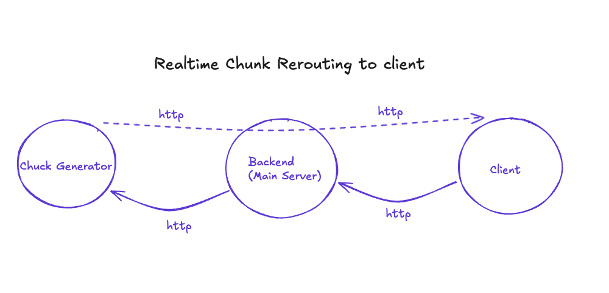

# How to Stream on HTTP connection 
( like all the llms do )

### Why? 
Since all the LLMs streamed response, I found it very difficult to reroute the packets to the client when calling it from the backend.
This made me lose the whole functionality as the server would wait for the full response, and then send the whole reposonse together. So I decided to learn the implimentation of the streaming feature to understand it better. 

### its pretty simple...



# Go Implimentation

> The Implimentation is very minimal. ( MVP )

in the Code Snippets below, I have not handled all the errors, You can find the working code in the repository. [github.com/kirtansoni/streaming-in-http](github.com/kirtansoni/streaming-in-http) 


## Chunk Generator

```go
func generateHandler(w http.ResponseWriter, r *http.Request) {
    w.Header().Set("Content-Type", "text/plain")
    w.Header().Set("Transfer-Encoding", "chunked")
    
    flusher, ok := w.(http.Flusher)
    if !ok {
        http.Error(w, "Streaming unsupported", http.StatusInternalServerError)
        return
    }

    // chunks are generated here. 
    for i := 1; i <= 100; i++ {
        chunk := fmt.Sprintf("Chunk %d [%s]\n", i, time.Now().Format("15:04:05.000"))
        _, err := w.Write([]byte(chunk))
        if err != nil {
            log.Printf("Write error: %v", err)
            return
        }
        flusher.Flush()
        time.Sleep(time.Millisecond * 100) // 10 chunks per second
    }
}
```

## Backend ( Rerouting to client )
```go
func proxyHandler(w http.ResponseWriter, r *http.Request) {
    // Request the chunks from the generator
    resp, err := http.Get("http://localhost:8081/generate")
    if err != nil {
        http.Error(w, "Generator service error", http.StatusInternalServerError)
        return
    }
    defer resp.Body.Close()

    w.Header().Set("Content-Type", "text/plain")
    w.Header().Set("Transfer-Encoding", "chunked")

    // get flusher here ( as we are also streaming the reponse from the generator )
    flusher, ok := w.(http.Flusher)
    if !ok {
        http.Error(w, "Streaming unsupported", http.StatusInternalServerError)
        return
    }

    buf := make([]byte, 1024)


    for {
        n, err := resp.Body.Read(buf)
        if err == io.EOF { break } //stop streaming at the End
        
        if n > 0 {
            _, _ := w.Write(buf[:n]) //write to response
            flusher.Flush() // send
        }
    }
}
```